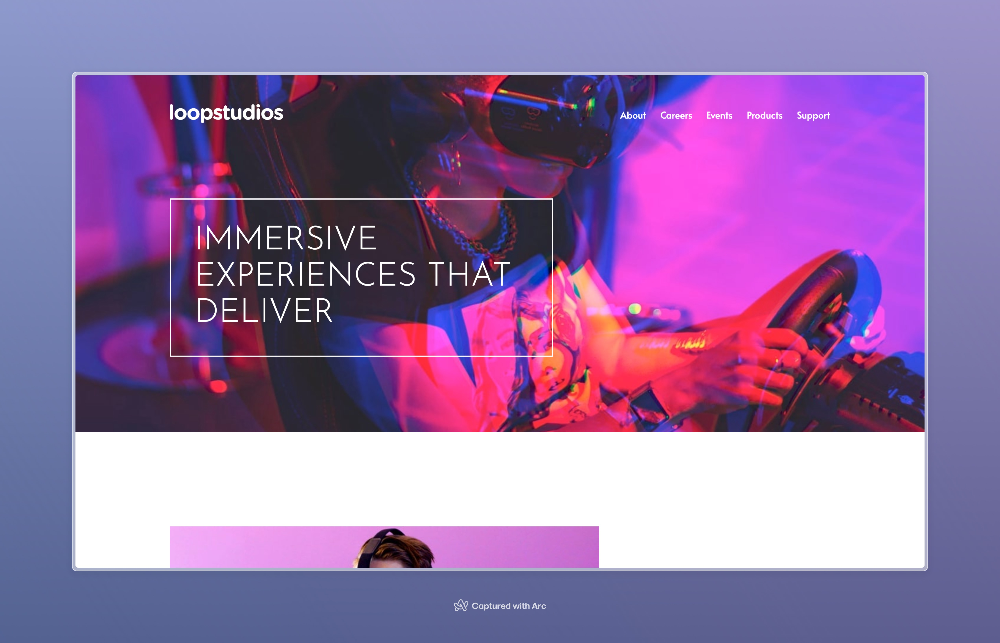

# Frontend Mentor - Loopstudios landing page solution

This is a solution to the [Loopstudios landing page challenge on Frontend Mentor](https://www.frontendmentor.io/challenges/loopstudios-landing-page-N88J5Onjw). Frontend Mentor challenges help you improve your coding skills by building realistic projects.

## Table of contents

- [Overview](#overview)
  - [The challenge](#the-challenge)
  - [Screenshot](#screenshot)
  - [Links](#links)
- [My process](#my-process)
  - [Built with](#built-with)
  - [Useful resources](#useful-resources)
- [Author](#author)

## Overview

### The challenge

Users should be able to:

- View the optimal layout for the site depending on their device's screen size
- See hover states for all interactive elements on the page

### Screenshot

### Links

- Solution URL: [https://www.frontendmentor.io/challenges/loopstudios-landing-page-N88J5Onjw/hub](https://www.frontendmentor.io/challenges/loopstudios-landing-page-N88J5Onjw/hub)
- Live Site URL: [https://loopstudios-landing-page-samuel-adu.vercel.app/](https://loopstudios-landing-page-samuel-adu.vercel.app/)

## My process

### Built with

- Semantic HTML5 markup
- CSS custom properties
- Flexbox
- CSS Grid
- Mobile-first workflow
- BEM Naming Methodology
- [SASS](https://sass-lang.com/) - Syntactically Awesome Style Sheets

### Useful resources

- [SASS Guidelines](https://sass-guidelin.es/#responsive-web-design-and-breakpoints) - This helped me structure my stylesheet.

## Author

- Website - [Add your name here](https://www.samueladu.dev)
- Frontend Mentor - [@samuel-adu](https://www.frontendmentor.io/profile/samuel-adu)
- LinkedIn - [@thesamueladu](https://www.linkedin.com/in/thesamueladu/)
